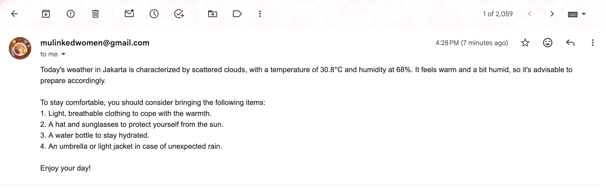
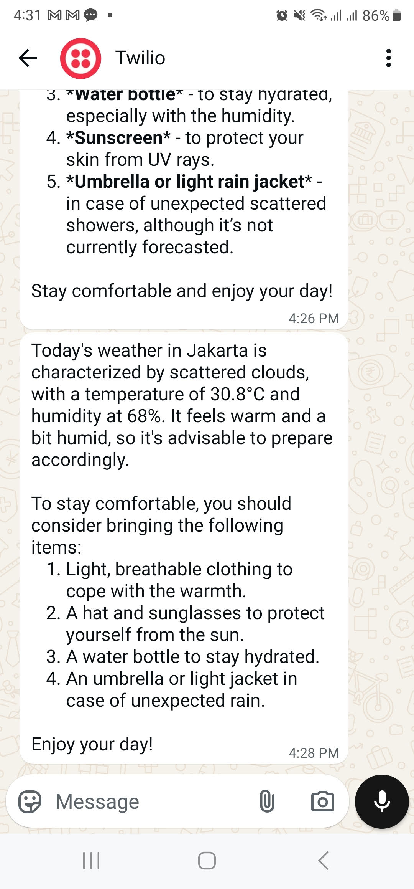

<p align="center">
<h1 align="center">🌦️ AI Weather Agent
</h1>
</p>

<p align="center">
    
    
    
    
</p>


<p align="center">
  <a href="https://youtu.be/BTNuEiHJ1kU" target="_blank">
    
    <br>
    <strong>▶️ Watch Demo on YouTube</strong>
  </a>
</p>

<p align="center">
<h3 align = "center"> Notification Outputs
</h3>
</p>

<p align="center">
  <br/>
  <em>Email Notification </em>
</p>


<p align="center">
  <br/>
  <em>Whatsapp Notification via Twilio </em>
</p>

## 🌦️ AI Weather Agent
An AI Weather Agent that combines real-time weather data with AI-powered reasoning to answer user's weather-related questions and deliver personalized insights via email and WhatsApp notifications.

## 📋 What's this model about?

The AI Weather Agent is a smart assistant that:
- Fetches real-time weather data from OpenWeather API
- Uses OpenAI's GPT models to analyze and reason about weather conditions
- Answers specific weather-related questions in natural language
- Sends notifications via both Email and WhatsApp using Twilio
- Provides actionable insights based on weather forecasts

## 🛠️ Tech Stack

### **Core Technologies:**
- **Python 3** - Primary programming language
- **OpenAI API** - AI reasoning and natural language processing
- **OpenWeather API** - Real-time weather data
- **Twilio API** - WhatsApp message delivery
- **SMTP/Gmail API** - Email notifications

### **Python Libraries:**
- `openai` - AI model integration
- `requests` - HTTP requests for API calls
- `python-dotenv` - Environment variable management
- `twilio` - WhatsApp messaging
- `smtplib` - Email sending

## ✨ Features

### **🌤️ Real-Time Weather Information**
- Fetches current weather data for any city worldwide
- Includes temperature, humidity, and weather conditions

### **🤖 AI-Powered Reasoning**
- Natural language processing for weather queries
- Context-aware responses based on current conditions
- Personalized recommendations and insights

### **📱 Multi-Channel Notifications**
- **Email Delivery**: Sends detailed weather reports via SMTP
- **WhatsApp Integration**: Instant notifications through Twilio


## Setup

### Create a virtual environment and install dependencies

Using `venv`:
```bash
python3 -m venv .wtvenv
source .wtvenv/bin/activate
```

### Install requirements

```bash
pip install -r requirements.txt
python3 app.py
```

### Keys Required
- OpenAI API Key
- OpenWeatherMap API Key
- Gmail App Password (for SMTP)
- Twilio Account (for WhatsApp/SMS)

### Create .env file for all your keys with this template:

OPENAI_API_KEY=your_openai_api_key

WEATHER_API_KEY=your_openweather_api_key

TWILIO_SID=your_twilio_account_sid

TWILIO_AUTH=your_twilio_auth_token

TWILIO_FROM=whatsapp:your_twilio_phone_number

TWILIO_TO=whatsapp:recipient_whatsapp_number

EMAIL_USER=your_email@gmail.com

EMAIL_PASS=your_app_password

EMAIL_TO=recipient_email@example.com


## Example

#### Input

```
🌦️ AI Weather Agent
City: Jakarta
Your question: How's the weather today? what should I bring to prepare myself for today's weather?
```

#### Output
```
City =>  Jakarta
⛅ The weather in Jakarta is scattered clouds, temperature 30.8°C, humidity 68%.
🤖 Today's weather in Jakarta is characterized by scattered clouds, with a temperature of 30.8°C and humidity at 68%. It feels warm and a bit humid, so it's advisable to prepare accordingly.

To stay comfortable, you should consider bringing the following items:
1. Light, breathable clothing to cope with the warmth.
2. A hat and sunglasses to protect yourself from the sun.
3. A water bottle to stay hydrated.
4. An umbrella or light jacket in case of unexpected rain.

Enjoy your day!
📧 Email sent to urfanaxxxx@gmail.com
📱 WhatsApp message sent to whatsapp:+628224625xxxx
✅ Sent to Email and WhatsApp

```